# Ark 工程技术栈与数据流展示

本文档用于公开作品集展示，重点说明 Ark 项目的架构分层、图形/渲染调用链、客户端与服务端数据流、核心技术栈落点，以及各源码目录之间的关系。

> 本 showcase 源码包经过裁剪与脱敏，目标是展示工程设计与技术能力，不保证直接编译运行。

## 一句话架构

Ark 是一个 `Godot 4.6 + C#/.NET 10` 的 3D 客户端，配套 `ASP.NET Core + Orleans + SignalR + TCP` 的服务端权威多人在线后端。客户端负责渲染、输入、预测、UI 与表现层同步；服务端负责登录、角色、世界状态、战斗、经济、公会、副本、任务、脚本、建造、载具、太空飞行等权威业务与实时快照广播；共享层统一 DTO、事件和协议模型。

## 总体架构图

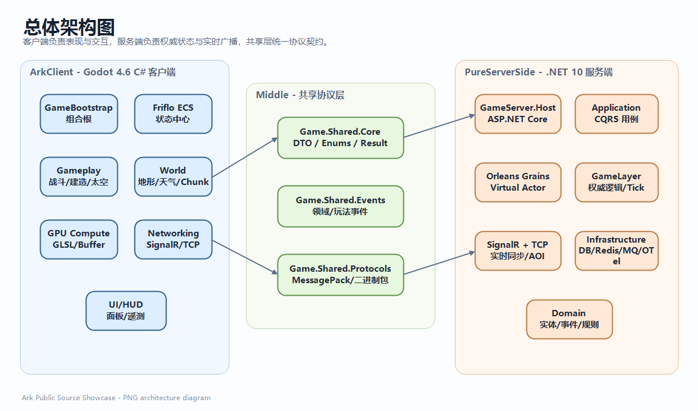

## 技术栈落点

| 技术/能力 | 源码位置 | 用途 |
| --- | --- | --- |
| Godot 4.6 C# | `ArkClient/Ark.csproj`, `ArkClient/project.godot` | 3D 客户端、场景、节点、渲染、输入、UI |
| .NET 10 | `ArkClient/**/*.csproj`, `PureServerSide/**/*.csproj` | 客户端和服务端统一 C# 技术栈 |
| Godot Autoload Composition Root | `ArkClient/src/GameBootstrap.cs`, `ArkClient/src/Bootstrap/*` | 统一初始化 ECS、GPU、世界、网络、UI、玩法模块 |
| Friflo ECS | `ArkClient/src/Ark.Ecs`, `ArkClient/src/Ark.Systems`, `ArkClient/src/Ark.Services` | 数据驱动实体状态、表现层同步、本地预测、远端快照落地 |
| GPU Compute / GLSL | `ArkClient/src/Ark.Gpu`, `ArkClient/src/Ark.World.Terrain` | 地形高度图生成、视锥剔除、群体移动、GPU 粒子 |
| 程序化地形 / Chunk | `ArkClient/src/Ark.World.Terrain` | 高度场生成、Chunk 流式加载、LOD、地形修改回放 |
| Godot UI/HUD | `ArkClient/src/Ark.UI` | 模式 HUD、建造面板、火箭装配、网络状态、战斗 UI |
| SignalR Client | `ArkClient/src/Ark.Networking/SignalR` | 低频业务 RPC、登录、角色、任务、经济、脚本等 |
| TCP Client | `ArkClient/src/Ark.Networking/Tcp` | 高频移动、战斗、观察点、服务端快照等实时数据 |
| ASP.NET Core Host | `PureServerSide/GameServer.Host` | 服务启动、Minimal API、健康检查、模块注册 |
| Orleans Virtual Actor | `PureServerSide/GameServer.Grains.*` | 玩家、飞船、星系、市场、公会、副本、技能、脚本等状态承载 |
| CQRS/Mediator | `PureServerSide/GameServer.Application.*` | 业务命令、查询、Handler、验证与用例编排 |
| DDD Domain | `PureServerSide/GameServer.Domain.*` | 领域实体、值对象、领域事件、业务规则 |
| SignalR Hub | `PureServerSide/GameServer.Networking.SignalR` | 世界、战斗、载具、太空、建造等实时 Hub |
| TCP Transport | `PureServerSide/GameServer.Networking.Transport` | System.IO.Pipelines、长度前缀帧、低延迟广播 |
| EF Core / PostgreSQL | `PureServerSide/GameServer.Infrastructure.Persistence` | 账号、角色、世界状态等持久化 |
| Redis Hybrid Cache | `PureServerSide/GameServer.Infrastructure.Caching` | 热数据缓存、状态加速 |
| RabbitMQ / MassTransit | `PureServerSide/GameServer.Infrastructure.Messaging` | 领域事件、跨模块消息、异步解耦 |
| OpenTelemetry | `PureServerSide/GameServer.Infrastructure.Monitoring` | 监控、链路追踪、可观测性 |
| MessagePack / Binary Protocol | `Middle/Game.Shared.Protocols` | 高效 DTO 序列化、自定义战斗/移动包 |
| Roslyn Analyzer | `ArkClient/src/Ark.Analyzers` | 工程治理：ECS 优先、DTO 映射、网络层边界、Godot 节点依赖约束 |

## 客户端启动与图形调用链

客户端的核心入口是 `GameBootstrap`。它不是单纯写业务逻辑，而是作为客户端 Composition Root，把渲染、ECS、GPU、世界、网络和 UI 组装起来。

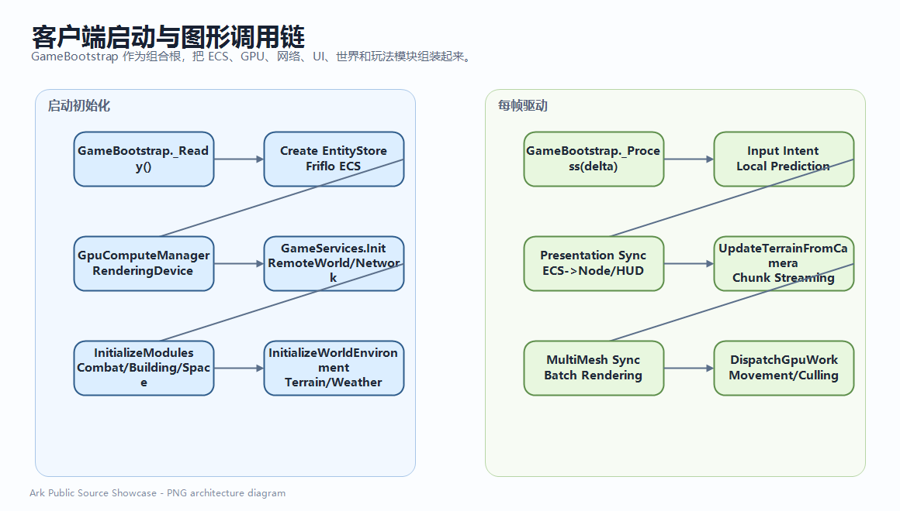

## GPU 地形生成调用链

程序化地形不是静态资源导入，而是通过 CPU/GPU 协同生成。Chunk Manager 根据相机位置决定加载范围，后台生成地形数据，GPU 可用时使用 Compute Shader 生成高度图，最终构建 Godot Mesh。

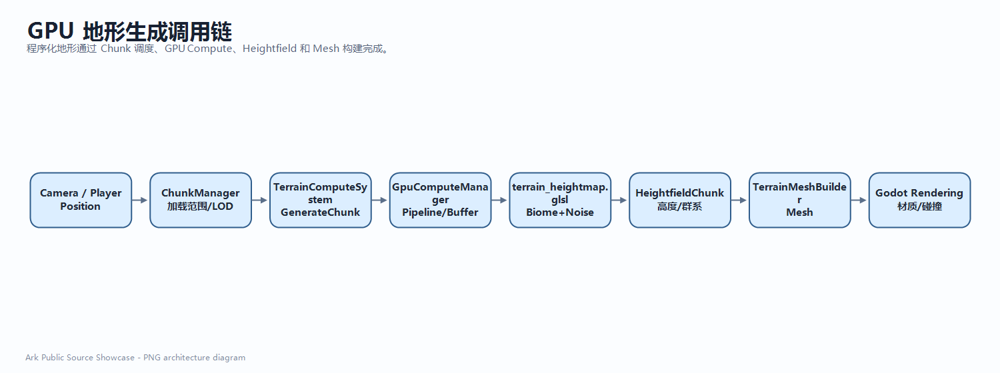

### 图形相关源码对应

| 调用阶段 | 关键源码 | 展示重点 |
| --- | --- | --- |
| GPU 设备与资源管理 | `ArkClient/src/Ark.Gpu/GpuComputeManager.cs` | RenderingDevice、ComputePipeline、StorageBuffer、UniformSet、GPU 双缓冲 |
| 高度图 Compute | `ArkClient/src/Ark.World.Terrain/TerrainComputeSystem.cs` | 地形高度图 GPU 并行生成，失败时 CPU fallback |
| Shader | `ArkClient/src/Ark.Gpu/shaders/terrain/terrain_heightmap.glsl` | 群系参数、噪声、地形高度生成 |
| Chunk 调度 | `ArkClient/src/Ark.World.Terrain/ChunkManager.*.cs` | 相机驱动 Chunk 流式加载、LOD、后台线程生成、卸载策略 |
| Mesh 构建 | `ArkClient/src/Ark.World.Terrain/TerrainMeshBuilder.cs` | Heightfield -> Mesh、法线、材质、Godot 渲染节点 |
| 远景地形 | `ArkClient/src/Ark.World.Terrain/FarTerrainPlane.cs` | 高空/远景表现优化 |
| 视锥剔除/群体移动 | `ArkClient/src/Ark.Gpu/shaders/culling`, `ArkClient/src/Ark.Gpu/shaders/movement` | GPU 侧批量计算，减少 CPU 逐实体开销 |

## 客户端表现层数据流

客户端内部以 ECS 为中心，Godot Node 主要负责表现和输入，不直接承担核心状态来源。这样可以把“游戏状态”和“渲染对象”解耦。

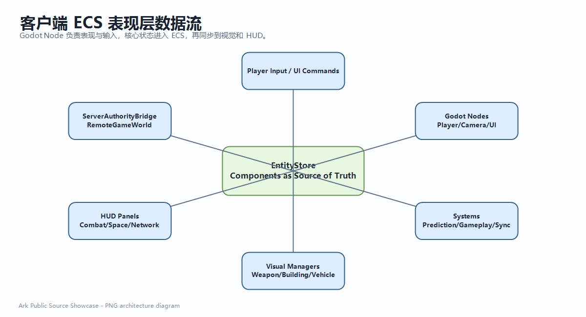

## 服务端模块化启动链

服务端 `GameServer.Host` 是组合根，统一注册 Orleans、模块、基础设施、网络通道和 GameLayer 权威逻辑。

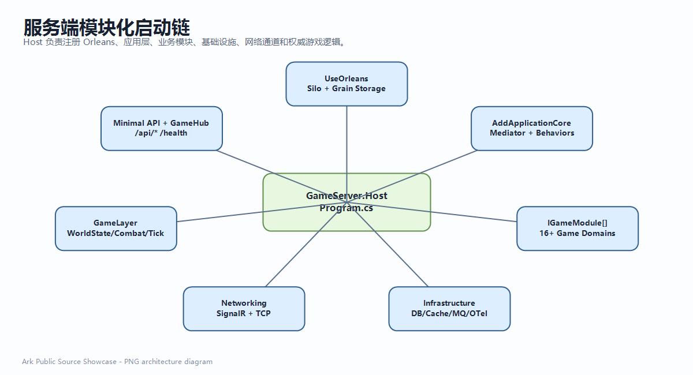

## 服务端权威实时同步流

服务端以固定 Tick 推进世界状态，并按玩家观察区域 AOI 生成可见实体快照。TCP 优先用于高频低延迟数据，SignalR 作为业务 RPC 和 fallback 通道。

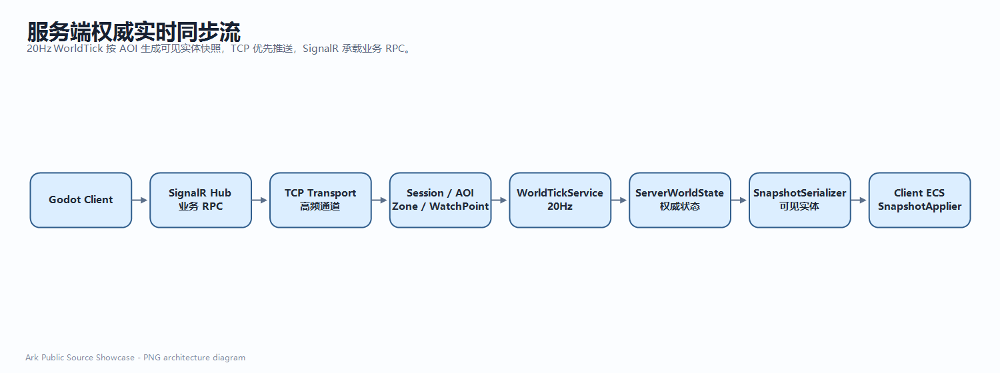

## 玩家动作到服务端权威处理

客户端不会直接把结果写死成最终状态，而是把玩家意图发送到服务端。服务端校验、更新权威状态，再通过事件或快照回推客户端。

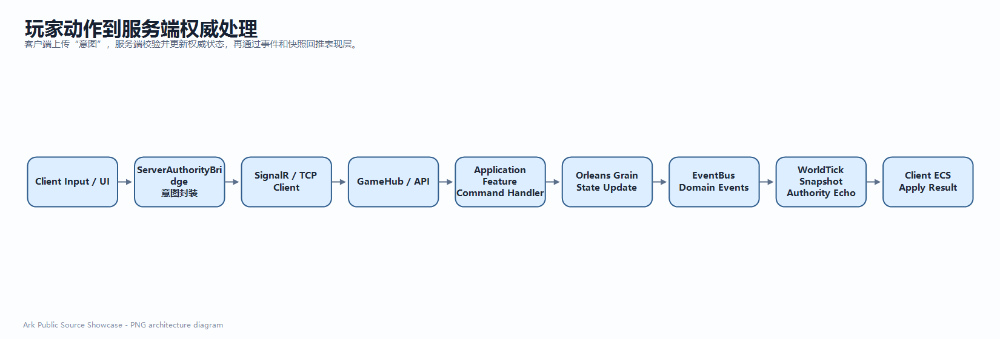

## 服务端业务域关系

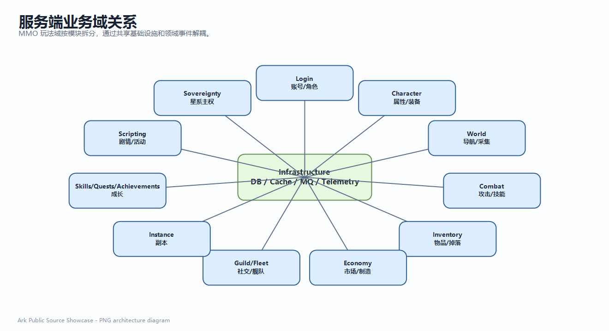

## 共享协议如何串起客户端和服务端

`Middle` 是客户端与服务端之间的契约层，避免两边各自定义字段导致同步不一致。

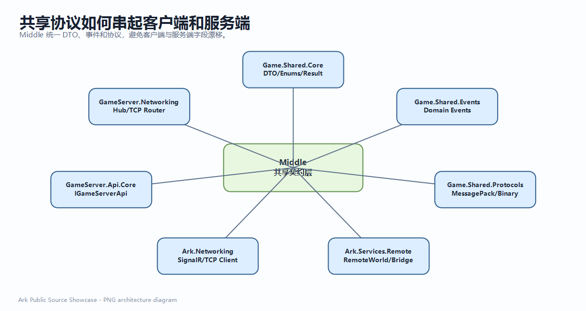

## 网络通道分层

| 通道 | 典型源码 | 数据类型 | 适合场景 |
| --- | --- | --- | --- |
| SignalR RPC | `ArkClient/src/Ark.Networking/SignalR`, `PureServerSide/GameServer.Networking.SignalR` | DTO、命令、查询、业务结果 | 登录、角色、任务、经济、公会、脚本、建造操作结果 |
| TCP 高频通道 | `ArkClient/src/Ark.Networking/Tcp`, `PureServerSide/GameServer.Networking.Transport` | 二进制帧、移动包、观察点、快照 | 高频位置同步、战斗状态、AOI 快照、实时世界状态 |
| MessagePack | `Middle/Game.Shared.Protocols/Serialization/ProtocolSerializer.cs` | 跨端消息序列化 | 较复杂 DTO 的紧凑传输 |
| 手写二进制包 | `Middle/Game.Shared.Protocols/Serialization/CombatPacketParser.cs` | 固定布局包 | 移动、伤害、观察点等高频低开销数据 |

## 持久化、缓存、消息和监控

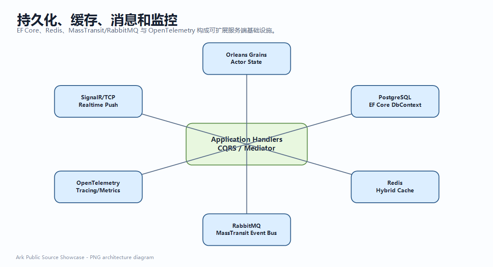

## 典型端到端链路

### 登录与进入世界

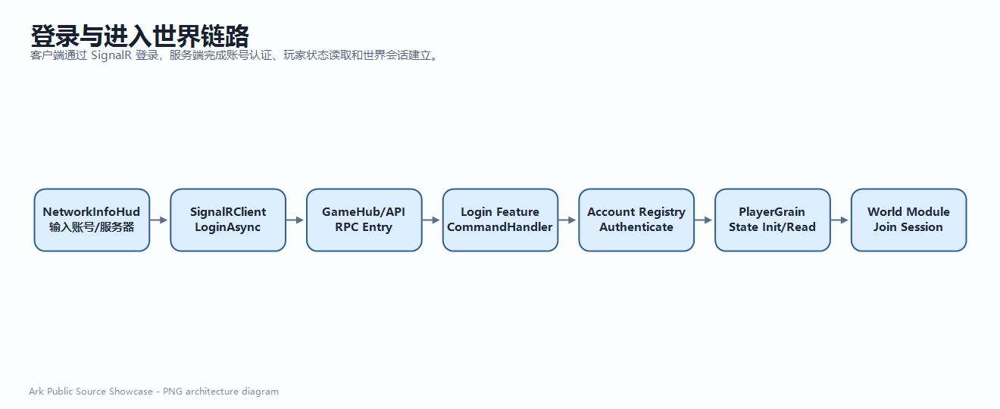

### 建造操作

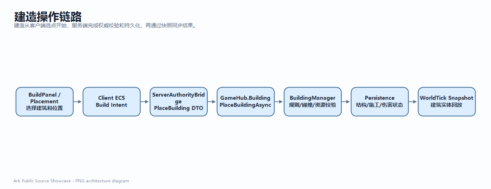

### 火箭/太空玩法

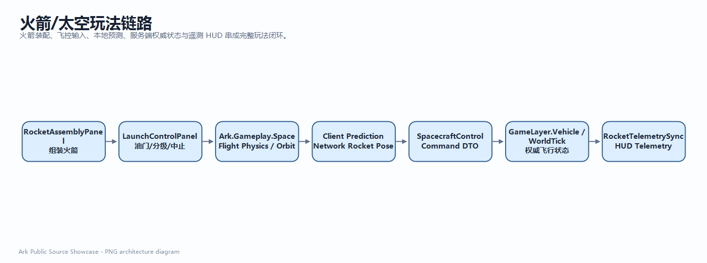

## 工程治理亮点

本项目不仅包含业务代码，还包含用于长期维护的工程治理代码：

| 能力 | 源码位置 | 价值 |
| --- | --- | --- |
| ECS 优先规则 | `ArkClient/src/Ark.Analyzers/EcsFirst*.cs` | 防止业务状态绕过 ECS 直接写 Node |
| DTO 映射生成/检查 | `ArkClient/src/Ark.Analyzers/DtoToEcsMapperGenerator.cs` | 降低手写映射错误 |
| 网络层依赖边界 | `ArkClient/src/Ark.Analyzers/NetworkLayerGodotDependencyAnalyzer.cs` | 避免网络层反向依赖 Godot 表现层 |
| Godot Node 结构变化约束 | `ArkClient/src/Ark.Analyzers/EcsStructuralChangeFromGodotNodeAnalyzer.cs` | 保持表现层和数据层职责清晰 |
| Analyzer 测试 | `ArkClient/src/Ark.Analyzers.Tests` | 让架构规则可验证 |